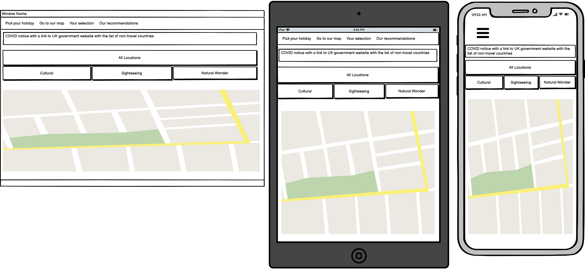
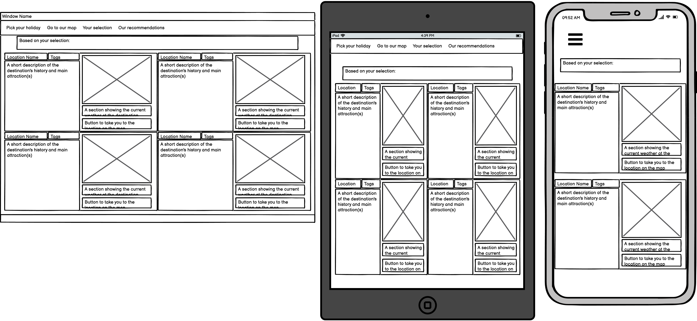

# Milestone-Project-2
My second Code Institute milestone project concerning User Centric Frontend Development

## Table Of Contents
* [Purpose of the website](#purpose-of-the-website)
* [User Experience (UX)](#user-experience-design)
    * [User Stories](#user-stories)
    * [Structure](#structure)
    * [Design and Wireframes](#design-and-wireframes)
* [Features](#Features)
    * [Existing Features](#existing-features)
* [Technologies](#Technologies)
* [Testing and Bug Fixes](#testing-and-bug-fixes)
* [Deployment](#deployment)
    * [Project Creation](#project-creation)
    * [GitHub Pages](#using-github-pages)
    * [Locally](run-locally)
* [Credits](#credits)

## Purpose of the website

### User Experience Design
#### User Stories

##### As a first time visitor:
- As a first time visitor, I want to easily navigate this website
- As a first time visitor, I want there to be content which will help me decide on a holiday location
- As a first time visitor, I want to be able to use this website comfortably on any of my devices

##### As a returning visitor:
- As a returning visitor, I want to easily find any locations I have previously seen on the site
- As a returning visitor, I want to see locations which I may not have seen on the site before

##### As a frequent visitor
- As a frequent visitor, I want to sign up to a newsletter to recieve emails regarding holiday destinations
- As a frequent visitor, I want to also access a government website to see if the holidays displayed are currently at high risk of COVID-19
#### Structure

#### Design and Wireframes

##### Colour scheme
I created a colour scheme through coolers to create a colourful, mosaic-like colour scheme which could match the holiday finding website. The main colours used, specifically together, are laser-lemon:  and safety-orange-blaze-orange:  for the header and the location boxes in particular.

##### Typography
I have used the same 2 fonts throughout the website; Exo for the navbar roboto slab for the body.

##### Images
I have used stock images of each location in the location's box in a 1:1 ratio.

##### Wireframes
I have grouped my wireframes into sections below, with each set consisting of a small, mid and large sized screen.

Pick Section

Selection Section

Recommended Section

To access these wireframes seperately, click the links below:
* [My pick section wireframes](assets/wireframes/pick.png)
* [My selection section wireframes](assets/wireframes/selection.png)
* [My recommended section wireframes](assets/wireframes/recommended.png)

##### Divergences from my wireframes
In my wireframes for both the selection and recommended sections, I have allocated the space under the image for each location as sapce for a weather API. I had difficulty with the API weather js and elected to instead use a form at the bottom linked to email js for a second API.

## Features
- The dominating feature of this website is the interactive map, which uses [Leaflet 1.7.1](https://leafletjs.com/), an open source map API. I used a JS file to add a number of markers which have popup text when clicked. I also added the ability to pan the map immediately to a location by pressing the button at the bottom left of each location's box.

- To work along with the map and box layout of the website, I added buttons towards the top of the page which filter a single tag when pressed (e.g. when the cultural tag is pressed, the selection section only shows boxes with the cultural tag)

- The form at the page footer can be filled out and submitted, with an auto reply message sent to the filled in email.

### Features I Would Have Liked To Implement

- As mentioned in the divergences from wireframes subsection, I didn't manage to implement the weather API properly, and I think this would have been an intuitive and useful tool for this website to include.

## Technologies
* HTML
    * This project uses HTML for the structure and content of the site.
* CSS
    * This project uses a custom CSS file to style the site.
* JS
    * This project uses custom JS files to add functionality to the site.
* [Bootstrap](https://getbootstrap.com/docs/4.6/getting-started/introduction/)
    * This project uses Bootstrap CSS and JS to style the site and add layout and various functionalities such as buttons.
* [Google fonts](https://fonts.google.com/)
    * This project uses Google fonts to style the text in the site.
* [Balsamiq Wireframes](https://balsamiq.com/wireframes/?gclid=CjwKCAiA9bmABhBbEiwASb35Vz5eNriDRNqnP0yfLYeqI0aYF9r5Qf45QNEoXootlZ-VmwSloDl8rRoCdbcQAvD_BwE)
    * Balsamiq Wireframes were used to create wireframes for UX design.
* [Github](https://github.com/)
    * This project uses Github as the hosting site, which stores the code and deploys the site through [Gitpages](https://pages.github.com/).
* [Coolors](https://coolors.co/)
    * This project uses a colour scheme developed from the artist's album art through Coolors.
* [Leaflet 1.7.1](https://leafletjs.com/)
    * This project uses an interactive map developed from the Leaflet API.
* [Email.js](https://www.emailjs.com/)
    * EmailJS is used to add functionality to the form at the bottom of the page, sending an automatic response to the user.
* [Jquery](https://jquery.com/)
    * Jquery is used in this project as a method of adding functionality, specifically to the pick buttons toward the top of the page.

## Testing and Bug Fixes
This webpage is front end oriented, and as such will be tested for its layout and responsiveness across browsers and page sizes. I will also be testing each feature (the picking filter etc.)
Testing will be done across google chrome, mozilla firefox and microsoft edge at small (phone), medium (tablet/notebook) and large (any larger screen) sizes.

To be considered successful, in each browser and at each size the webpage should;
- Contain working and correct hyperlinks, both internal and external, with external links opening in a fresh tab.
- Have no overlapping divs/ sections such that the layout is compromised.
- Display a similar layout as to the wireframes provided above, with the exception of changes in layout design mentioned alongside the wireframes.

Each browser should fulfill the following test cases upon testing:

| Test Description  	|   Shorthand Reference	|
|---	|---	|
|  Layout should be preserved at all window sizes	|  TC1 	|
|  All external links should be in correct working order and create a fresh tab 	|   TC2 |
|  All internal links should be in correct working order 	|   TC3 |
|  All location buttons should pan the map to the corresponding location 	|   TC4	|
|  Each pick button should filter locations correctly 	|   TC5	|

## Deployment

### Project Creation
This project was created in its own repository using Github under my account name. It is named Willdeakin/Milestone-Project-2 and contains all the necessary files to run the website.

I used Gitpod to write and edit these files, using the bash terminal for saving, updating and version control of the project. For the purpose of this project, I used these commands:
- git add -A; to add all files to the staging area
- git commit -m "*message detailing the changes from the last version*"; to commit changes from the staging area to the local repository
- git push; to push committed changes from the local repository to the Github repository

### Using GitHub Pages
- Access the GitHub repository [here](https://github.com/Willdeakin/Milestone-Project-2/).
- Click the Settings tab in the tabs menu.
- Scroll to the Github Pages section.
- Make sure that the branch selected is main; it should already be selected, if not this should be saved with the button just next to the branch dropdown.
- Click the link on the first line, which should read 'https://willdeakin.github.io/Milestone-Project-2/'

### Run Locally
- Access the GitHub repository [here](https://github.com/Willdeakin/Milestone-Project-2/).
- Click the Code dropdown.
    - Download the ZIP file, which can be unpackaged and opened with an IDE.
- Or 
    - Copy Git URL (there is a handy clip button next to the URL).
    - Open a development editor and a terminal window within the directory.
    - Use 'git clone' in the terminal followed by the copied URL.
    - You now have a copy of the project in your directory.
